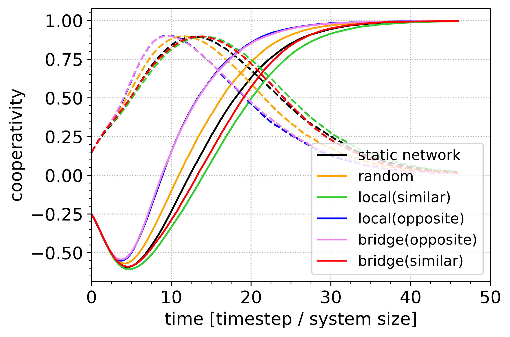

# *Guided rewiring of social networks reduces polarization and accelerates collective action*

by
Lilli Frei,
Jordan Everall,
Andrew K. Ringsmuth


This paper has been submitted for publication in Nature Human Behaviour.

In this project, we use an agent based model where agents are embedded in a social network to analyse the effect of different rewiring strategies on the speed and magnitude of cooperative consensus formation, or depolariazion in social groups. We are interested in these dynamics because socio-political polarization is a major barrier to collective action problems such as climate change, which must urgently be addressed. We investigate rewiring algorithms representing random meetings, introduction by mutual acquaintances, and bridging between socially distant communities. We find that building lasting links between polarized individuals and communities can accelerate consensus formation when the sociopolitical environment is favourable. This strengthens the evidence that promoting connection between polarized communities could accelerate collective action on urgent global challenges.



## Software implementation


All source code used to generate the results and figures in the paper are in
the `Analysis` folder. The model itself is containted in `models_checks.py`, `run.py` runs the model. All 
sensitivity analyses are run by scripts ending in "..parameter_sweep". Results generated by the code are saved in `Output`, and figures in `Figs`.

## Structure

```
├── README.md
├── requirements_no_win.txt
├── Analysis
│   ├── convergence_plots_paper_v3.py
│   ├── general_parameter_sweep.py
│   ├── heatmap_parameter_sweep.py
│   ├── heatmap_plots.py
│   ├── heatmap_plots_lilli.py
│   ├── models_checks.py
│   ├── network_analysis.py
│   ├── plots.py
│   ├── plots_paper.py
│   ├── rewiring_parameter_sweep.py
│   └── run.py
├── Figs
│   └── Various figures in PDF and PNG formats
├── Output
│   └── Various output files in CSV and PNG formats
└── Output_backup
    └── Backup of output files
```

## Getting the code

You can download a copy of all the files in this repository by cloning the
[git](https://git-scm.com/) repository:

    git clone https://github.com/lifrei/It-s_how_we_talk_that_matters.git

or [download a zip archive](https://github.com/lifrei/It-s_how_we_talk_that_matters/archive/refs/heads/main.zip).


## Dependencies

You'll need a working Python environment to run the code.
The recommended way to set up your environment is through the
[Anaconda Python distribution](https://www.anaconda.com/download/) which
provides the `conda` package manager.
Anaconda can be installed in your user directory and does not interfere with
the system Python installation.
The required dependencies are specified in the file `environment.yml`, as well as `requirements_no_win.txt` .

We use `conda` virtual environments to manage the project dependencies in
isolation.
Thus, you can install our dependencies without causing conflicts with your
setup (even with different Python versions).

Run the following command in the repository folder (where `environment.yml`
is located) to create a separate environment and install all required
dependencies in it:

    conda env create


## Reproducing the results

Before running any code you must activate the conda environment:

    source activate ENVIRONMENT_NAME

or, if you're on Windows:

    activate ENVIRONMENT_NAME

This will enable the environment for your current terminal session.
Any subsequent commands will use software that is installed in the environment.


## License

All source code is made available under a BSD 3-clause license. You can freely
use and modify the code, without warranty, so long as you provide attribution
to the authors. See `LICENSE.md` for the full license text.

The manuscript text is not open source. The authors reserve the rights to the
article content, which is currently submitted for publication in Nature Human Behaviour.
